# Tech-Care-Your-Health-Partner

**Smart Health Care System**  
A comprehensive web-based medical appointment system connecting patients with healthcare providers. The system facilitates appointment booking, lab test scheduling, ambulance services, and provides complete management dashboards for doctors and patients.

---

## ✨ Features

### 👥 For Patients
- **User Registration & Authentication** – Secure signup and login.
- **Doctor Search** – Find doctors by specialization with advanced filters.
- **Appointment Booking** – Book appointments with preferred doctors.
- **Lab Test Booking** – Schedule medical tests at partner laboratories.
- **Ambulance Service** – Emergency ambulance booking with real-time tracking.
- **Appointment Tracking** – View and manage appointments with status updates.
- **Feedback System** – Provide feedback about services and doctors.
- **Medical History** – Digital health records management.

### 👨‍⚕️ For Doctors
- **Doctor Registration** – Professional registration with specialization verification.
- **Dashboard** – Comprehensive management interface with analytics.
- **Patient Requests** – View and manage appointment requests.
- **Patient Management** – Track accepted patients and medical history.
- **Appointment Management** – Handle appointment status (Accept/Reject/Reschedule).
- **Schedule Management** – Set availability and working hours.
- **Prescription Management** – Digital prescription generation.

### 🏥 Administrative Features
- **User Management** – Manage patient and doctor accounts.
- **Service Management** – Oversee labs and ambulance services.
- **Analytics Dashboard** – System usage statistics and reports.
- **Content Management** – Manage website content and announcements.

---

## 🛠️ Technology Stack
- **Frontend:** HTML5, CSS3, JavaScript, Bootstrap 5, Font Awesome 6, AOS, Animate.css  
- **Backend:** PHP 8.0+, MySQL 5.7+, PHPMailer, MySQLi  
- **Security:** Prepared Statements, Input Validation, Session Management, Password Hashing, XSS Prevention  

---

## 📁 Project Structure

Tech-Care-Your-Health-Partner/
│
├── includes/
│ ├── header.php
│ ├── footer.php
│ ├── navbar.php
│ └── usernavbar.php
│
├── assets/
│ ├── css/
│ │ ├── style.css
│ │ └── responsive.css
│ │
│ ├── img/
│ │ ├── home.jpg
│ │ ├── doctors/
│ │ ├── driver/
│ │ └── testLab/
│ │
│ ├── js/
│ │ └── custom.js
│ │
│ └── vendor/
│
├── connection/
│ └── connection.php
│
├── patient/
│ ├── signUp.php
│ ├── signIn.php
│ ├── appointment.php
│ ├── doctors.php
│ ├── testLab.php
│ ├── ambulance.php
│ └── userdashboard.php
│
├── doctor/
│ ├── doctorsignUp.php
│ ├── doctorsignIn.php
│ ├── dashboard.php
│ ├── patient_request.php
│ ├── your_patients.php
│ ├── accept_user.php
│ └── reject_user.php
│
├── booking/
│ ├── bookAppointment.php
│ ├── booktestLab.php
│ └── bookambulance.php
│
├── index.php
├── forgetPassword.php
└── README.md


---

## 📸 Screenshots

## 📸 Screenshots

### 🏠 Home Page
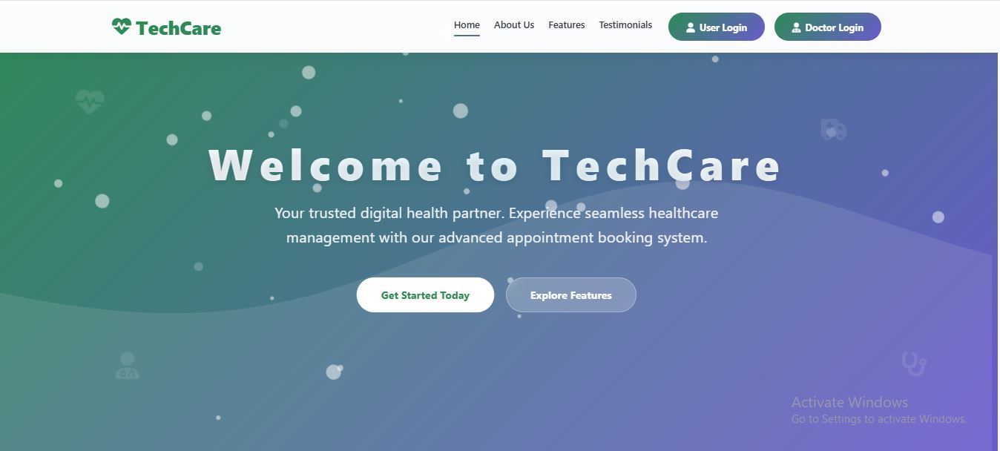

### 📝 User Signup
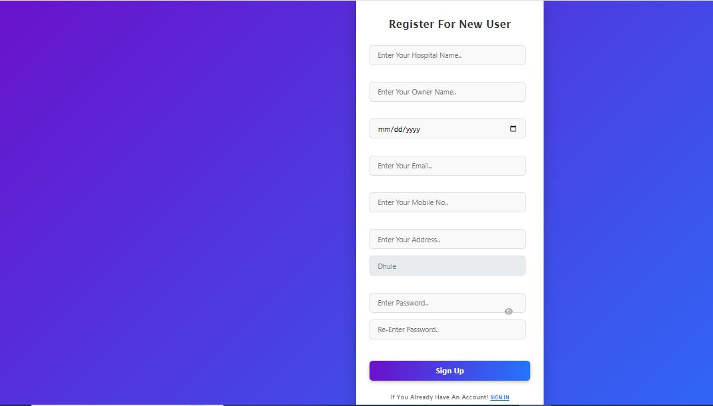

### 👥 User Dashboard
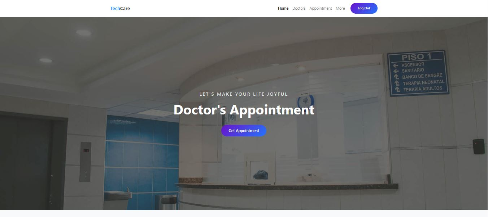

### 👨‍⚕️ Doctor Signup
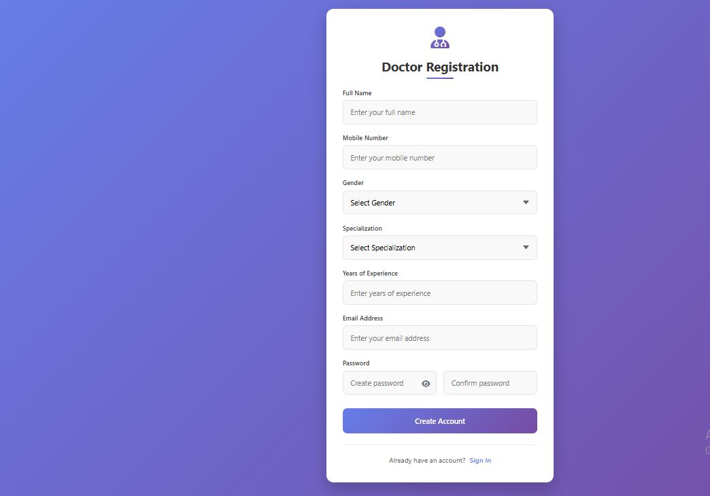

### 👨‍⚕️ Doctor Dashboard
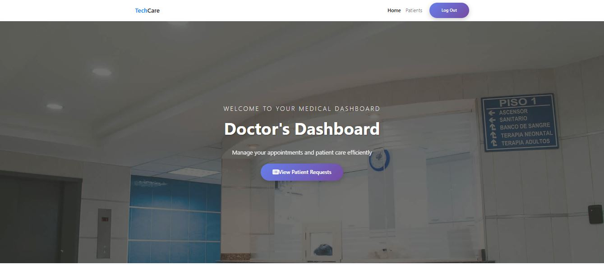

### 🔍 Find Doctor
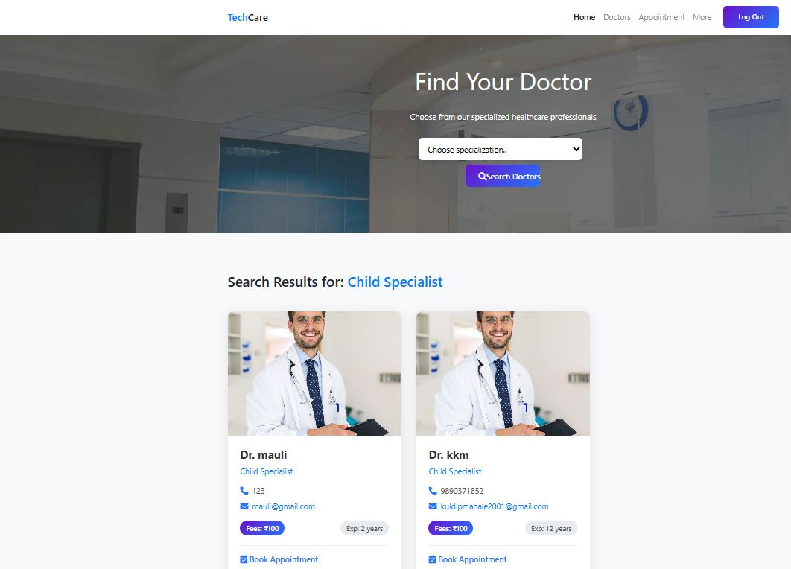

### 🧪 Lab
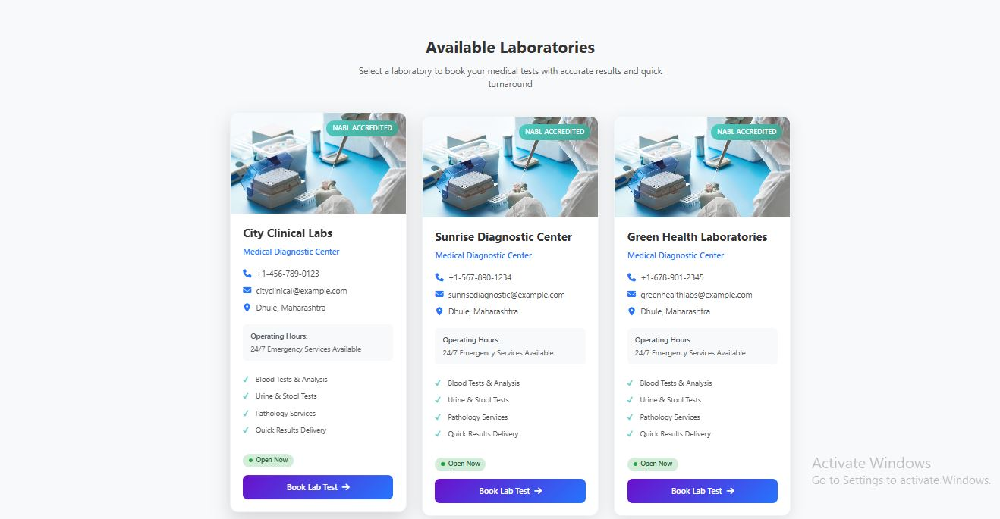

### 🚑 Ambulance
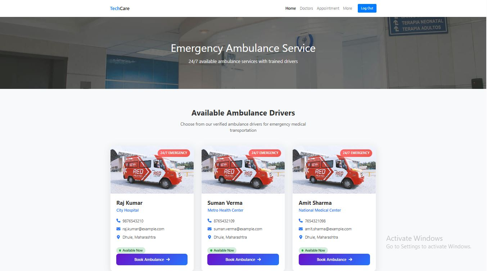

### 📝 Ambulance Form


### 📧 Ambulance Mail Confirmation


### 🧾 Patient Request 2
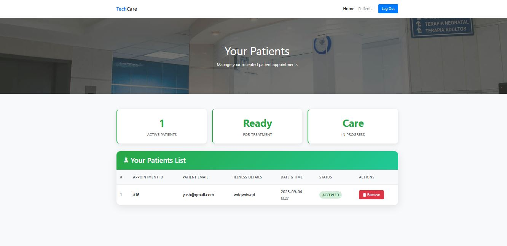

### 🧾 Patient Request
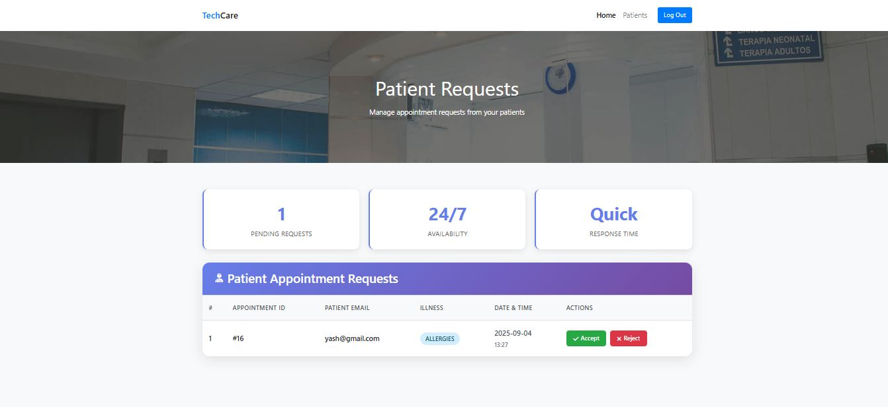

### ✅ Doctor Confirmation


### 📝 Lab Form
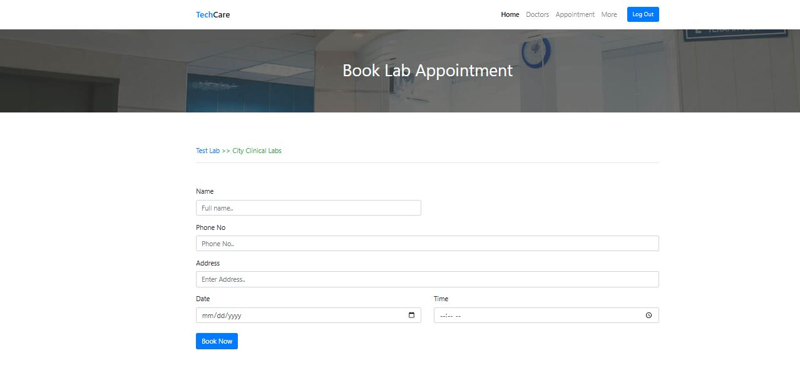


---

## 🔧 Installation Guide

### Prerequisites
- Web server (XAMPP/WAMP/MAMP)  
- PHP 7.4+  
- MySQL 5.7+  
- Composer (for PHPMailer)

### Local Development
1. Clone this repository:
```bash
git clone https://github.com/<your-username>/Tech-Care-Your-Health-Partner.git


## 📁 Project Structure

